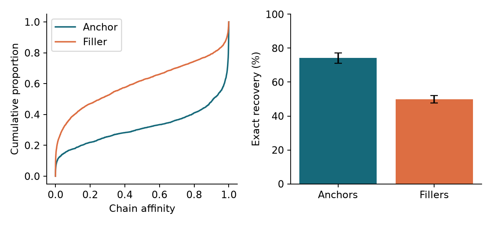
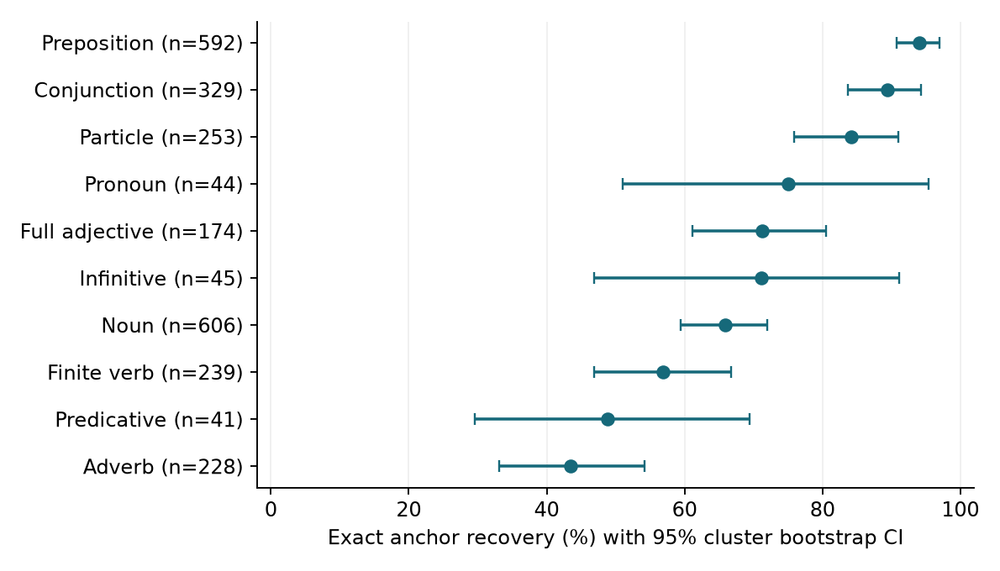
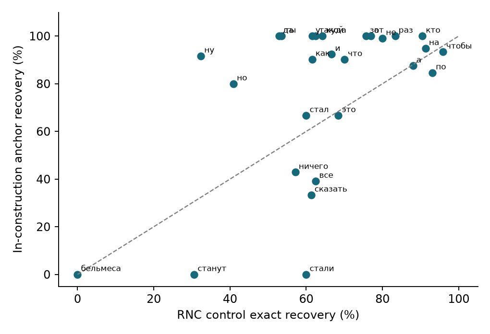

Expanded reproduction of nisinterp/ru-constructions-revealed • 26 September 2026

## Findings

On 300 constructions, anchors were recovered exactly in 74.2% of trials, compared with 49.9% for slot fillers. The average within-construction advantage was +20.1 percentage points (95% CI [16.0, 24.2]); 217 of 297 paired constructions favored anchors, with 11 ties.

Anchor recovery varies with part of speech. A joint test of POS terms after adjustment for token length, sentence length, word length and sample frequency gave p=3.58e-05. The adjusted anchor-versus-filler association was +9.7 percentage points (95% CI [6.3, 13.1]). These are observational associations, not proof that POS causes recovery differences.

For 27 matched word forms in cached RNC controls, the mean inside-minus-outside accuracy difference was +11.5 percentage points (95% CI [1.1, 21.5]). The stricter co-anchor subset has only five forms and an interval spanning zero. Within-sentence POS matching supports an anchor advantage, but not an advantage for all inside words pooled together.

## Which data sources should be used?

Use the sources in conjunction: the official Constructicon YAML supplies construction descriptions and slot annotations; the Hugging Face derivative supplies whole-construction boundaries; RNC sentences supply same-word controls. Do not concatenate Constructicon and Hugging Face examples as independent observations: their content overlaps heavily.

| Dataset size | Original repository | Expanded experiment |
| --- | --- | --- |
| Constructions | 30 | 300 |
| Example sentences | 150 | 1231 |
| Scored anchors / fillers (before scope correction) | 261 / 536 | 2722 / 4379 |
| Additional outside-span controls | 0 | 1888 |

All reported model evaluations were executed locally with the original ruRoberta-large checkpoint. No model fine-tuning or synthetic sentences were used.

---

# Data choice, sampling and exclusions

The pinned official Constructicon snapshot contains 4,001 records. Parsing retained 15,945 examples across 3,844 constructions. A uniform random sample of 300 eligible construction IDs (seed 20260926) was selected before model scoring, retaining all usable examples per selected construction. Identical normalized sentences were retained under only one construction/example owner.

This is a tenfold expansion in construction count and an 8.2-fold expansion in examples, not an evaluation of all 4,001 entries. The original 30-item sample was balanced by syntactic type and anchor class; the new random sample has a different composition. Between-study changes therefore cannot be attributed to sample size alone.

| Source | Audit | Role in this experiment |
| --- | --- | --- |
| Official Constructicon YAML | 4,001 records | Slot offsets; lexical anchor candidates; construction metadata |
| Hugging Face derivative | 20,993 rows / 3,998 IDs | Brace-delimited construction spans joined by ID + normalized text |
| Overlap | 20,637/20,993 rows (98.3%) | HF rows matching official examples or illustrations; not new independent data |
| Cached RNC | 695 targets / 27 forms | Same-word controls after expanded-inventory co-anchor filtering |

All three HF splits were joined only for annotation lookup: train=15,298, validation=2,842, test=2,853. There was no fitted task model or held-out predictive training evaluation. The HF table has 20,945 unique ID/sentence pairs and includes examples plus illustrations; illustrations were not added to the scored sample because equivalent slot annotation was unavailable.

Official-source exclusions: no anchor match: 509; residual markup: 73; no annotated slots: 477. Exclusion reasons follow a fixed priority and are counted per example.

HF boundaries matched 1213 of 1231 selected examples; 18 remained unmatched. The boundary audit identified 94 anchor labels and 708 filler labels outside the annotated span. The primary analysis removes scored targets in that category; unmatched targets remain flagged, and a matched-only sensitivity analysis is reported. The source-rule analysis is preserved separately.

The RNC controls are reused from the original repository, not newly crawled from the corpus. The original fetcher requires an RNC API token; this reproduction uses the publicly supplied cache and requires no credentials. The cached control vocabulary has not expanded with the construction inventory.

---

# Pipeline and meaning of the measurements

| Stage | Original method retained | Expansion / correction |
| --- | --- | --- |
| Parse | Strip [text]Role markup and retain character offsets | Apply to full inventory, then sample 300 constructions |
| Assign word roles | Slot overlap → filler; lexical or eligible lemma match → anchor | Extract Cyrillic anchors without grammatical tags; audit HF boundaries |
| Mask and score | ai-forever/ruRoberta-large; single / chain / lemma affinity | Batch masked-position states; add exact top-1 and single-token top-5 recovery |
| Analyze | Anchor/filler; POS/class/type slices; matched RNC forms; bootstrap | Cluster-aware accuracy, adjusted POS models, outside-span controls and sensitivity analyses |

An anchor is fixed lexical material in a construction. A filler is a word overlapping an annotated variable slot. Slot labels take precedence over lexical matches. Both are roles relative to one annotated construction; a filler can itself be a function word or belong to another construction. Anchor candidates are extracted from the construction name, using the original exact-form, citation-lemma and compound matching rules.

The model revision is 5192d064ca6ac67c14c40e017ce41612e010f05f. Inference uses evaluation mode, float32 and the original tokenizer. Each target word is masked separately; all other words remain visible. Inputs over 512 tokens and token boundaries crossing a target word are excluded rather than truncated. One filler target was excluded for a token crossing its word boundary; no overlength exclusion occurred. There were 7,101 construction, 695 RNC and 1,888 outside-span scored targets. The run logs and exclusion files record coverage.

Single affinity is the softmax probability of the original token, for one-token words only. Chain affinity masks all target subtokens and multiplies their conditional probabilities while restoring the gold prefix from left to right. Lemma affinity sums eligible one-token vocabulary forms with the same pymorphy3 lemma and leading-space class; it is not full lemma-generation accuracy.

Exact recovery is 1 only if every target subtoken is the top-ranked prediction at its chain step. The all-correct event equals fixed-length left-to-right greedy recovery: if any earlier prediction is wrong, exact word recovery is already impossible. Target subtoken count is known, so this is not unrestricted text generation. Single-token top-5 is reported separately. A probability above 0.5, affinity, and exact recovery are different measures.

Confidence intervals use 10,000 bootstrap resamples. Pooled accuracy resamples construction clusters, retaining word weighting; paired effects average anchor-minus-filler means equally across constructions with both roles. RNC comparisons weight matched forms equally and bootstrap forms. Sign tests omit ties in the extended analysis; the original analysis is retained unchanged. OLS linear-probability regressions use construction-cluster robust standard errors; their coefficients express adjusted percentage-point associations.

POS is the first context-free pymorphy3 analysis, as in the original pipeline. Ambiguous Russian words may be tagged incorrectly. The within-form-and-POS check therefore adds little independent disambiguation. Neither POS tagging nor automatic anchor alignment is independent human gold annotation.

---

# Replication of affinity and word recovery

| Metric | Original medians A/F | Expanded source-rule medians A/F | Expanded Cliff δ | Paired mean Δ |
| --- | --- | --- | --- | --- |
| p_single | 0.954 / 0.440 | 0.954 / 0.427 | 0.406 | 0.254 |
| p_chain | 0.884 / 0.240 | 0.917 / 0.274 | 0.404 | 0.243 |

The table reproduces the original probability analysis using its uncorrected span rule, so its expanded counts differ from the corrected primary analysis below. Original pooled Mann–Whitney tests assume independent words and are descriptive; construction bootstrap intervals and paired effects are the main uncertainty summaries. Full syntactic-type, anchor-class, tokenization, lemma and qualitative tables are preserved in results/original_tables/.

| Primary exact recovery | Targets | Accuracy | 95% CI |
| --- | --- | --- | --- |
| Anchors | 2628 | 74.2% | [71.2, 77.2] |
| Fillers | 3671 | 49.9% | [47.8, 52.0] |

Equal-construction accuracy difference: +20.1 points, CI [16.0, 24.2]; sign-test p=5.49e-19. Single-token-only accuracy is 79.5% for anchors and 57.3% for fillers. Restricting to single tokens addresses part of the word-length confound, but does not match lexical identity or word frequency.

---

# Does recovery depend on part of speech?

Among categories with at least 30 anchor tokens, observed accuracy ranges from 43.4% for adverb (n=228) to 94.1% for preposition (n=592). The differences are substantial descriptively; overlapping intervals should not be read as a complete pairwise significance test.

The anchor-only model groups POS categories with fewer than 30 observations into OTHER_RARE. With log(1+subtoken count), log(1+sentence tokens), character count and log(1+observed sample form count) included, the joint POS Wald statistic is 38.14, p=3.58e-05 (n=2628, R²=0.234). Sample frequency is a weak proxy and is not an independent corpus-frequency estimate.

Across anchors and fillers, the adjusted anchor coefficient is +9.7 points, CI [6.3, 13.1], p=2.51e-08. Thus POS-related differences and the anchor-role association must be considered separately. Construction-specific lexical content, semantic predictability and training exposure remain potential confounders.

| Original POS grouping | Anchor accuracy | Filler accuracy | n A/F |
| --- | --- | --- | --- |
| content | 61.3% | 40.5% | 1352 / 2803 |
| func | 87.9% | 80.1% | 1276 / 868 |

The inherited function-word group includes prepositions, conjunctions, particles, pronouns, interjections and predicatives; adverbs generally fall into the other group. This operational grouping is not a universal linguistic taxonomy. Within-POS, within-construction paired tests and Holm-adjusted sign-test p-values are supplied in tables/within_pos_construction_differences.csv.

---

# Same word forms inside versus RNC controls

| Comparison | Forms | In | Out | Δ points | 95% CI |
| --- | --- | --- | --- | --- | --- |
| All matched forms | 27 | 76.0% | 64.5% | +11.5 | [1.1, 21.5] |
| Co-anchor filter applicable | 5 | 65.0% | 46.1% | +18.9 | [-7.8, 45.7] |
| Same form + POS | 27 | 76.0% | 64.5% | +11.5 | [1.1, 21.5] |
| At least 5 examples each | 20 | 81.0% | 65.8% | +15.2 | [5.2, 25.3] |

The all-form comparison gives a Wilcoxon p-value of 0.0361; 17 form means are higher inside, with 1 ties. The corresponding sign-test p-value is 0.169, so the evidence is not uniform across tests. The strict five-form subset is inconclusive. Means in this table weight forms equally, not individual RNC sentences. Chain-affinity and single-token-affinity versions are in the machine-readable summary and matched-form CSV files.

The expanded co-anchor filter retains 695 cached targets, of which 137 meet the filter-applicable criterion. It rejects a sentence if all observed co-anchor keys of any relevant construction are present. Single-anchor constructions cannot be excluded by this rule. Even the applicable subset is a heuristic control, not proof that every target is outside every construction.

This baseline is limited by the original cache's vocabulary, few in-construction observations for some forms, differing genres and sentence lengths, and incomplete construction detection. The larger construction sample does not create a correspondingly larger independent RNC control sample. An authenticated, expanded RNC collection with manually verified negatives would be needed for a broad matched-lexeme claim.

---

# Inside versus outside the same annotated span

To broaden the contextual comparison, 1,888 words were sampled from outside HF-marked construction spans in 978 sentences spanning 282 constructions. Up to two outside words were sampled uniformly per sentence with a fixed seed, before scoring. All such sentences retain the same surrounding context as the inside targets.

| Inside role | Matching | Constructions | Δ points | 95% CI |
| --- | --- | --- | --- | --- |
| anchor | sentence | 282 | +12.7 | [8.1, 17.2] |
| anchor | sentence and pos | 207 | +10.4 | [3.4, 17.1] |
| filler | sentence | 275 | -9.6 | [-13.7, -5.5] |
| filler | sentence and pos | 215 | -2.7 | [-9.9, 4.4] |
| all inside | sentence | 282 | +4.0 | [0.4, 7.6] |
| all inside | sentence and pos | 258 | +2.7 | [-2.8, 8.2] |

After sentence-and-POS matching, the anchor advantage is +10.4 points, CI [3.4, 17.1]. The pooled inside-word estimate is +2.7 points, CI [-2.8, 8.2], and the filler estimate is -2.7 points, CI [-9.9, 4.4]. Thus these data support better recovery of anchors, not a general claim that every word inside a construction is easier to recover.

For sentence matching, word accuracies are averaged by role within each sentence, then inside-minus-outside differences are averaged within each construction and across constructions. For sentence-and-POS matching, only POS categories observed on both sides are paired before the same construction-level aggregation. The two estimates target different supported subsets. “All inside” refers to classified anchor and filler targets; in-span words with neither role are excluded, as in the original pipeline.

This comparison controls sentence context and, in the second version, observed POS, but not word identity. It addresses recovery inside versus outside the annotated target construction; an outside word may still instantiate some other construction. It cannot replace the same-word RNC comparison. Fillers and anchors should not be pooled without also examining their separate results.

---

# Robustness, errors and limits

| Anchor–filler sensitivity | Constructions | Δ accuracy points | 95% CI |
| --- | --- | --- | --- |
| Original span rule | 300 | +19.7 | [15.6, 23.8] |
| Only HF-matched examples | 296 | +20.2 | [16.0, 24.3] |
| Primary corrected rule | 297 | +20.1 | [16.0, 24.2] |

| Construction anchor kind | Anchor accuracy | Filler accuracy | n A/F |
| --- | --- | --- | --- |
| content | 44.2% | 47.0% | 353 / 704 |
| func | 74.6% | 52.8% | 327 / 583 |
| mixed | 79.6% | 50.0% | 1948 / 2384 |

Content-only constructions have pooled anchor accuracy of 44.2% versus 47.0% for fillers; superiority is not universal across construction kinds. Anchor kinds are automatically classified from name-derived lexical candidates. They are not identical to the original manually selected balanced strata. A small AI-assisted spot-check of 25 randomly selected in-span anchors (seed 991) found plausible alignments, but is not an independent annotation study and does not establish an error rate. Incidental occurrences of common anchor words inside broad spans and POS ambiguity can still bias results.

| Low-affinity anchor | Construction | Top first subtoken | Chain affinity |
| --- | --- | --- | --- |
| тьма-тьмущая | тьма(-)тьмущая NP-Gen Cop / NP-Gen | . | 7.07e-09 |
| числился | NP-Nom числиться Adj-Ins/NP-Ins | Федоров | 6.58e-08 |
| припеваючи | NP-Nom жить припеваючи | спокойно | 5.69e-07 |

The prediction column shows only the first masked subtoken, not a complete generated replacement. A failure of exact lexical recovery need not mean failure to recognize a construction: alternatives or synonyms are counted as wrong. Conversely, high filler recovery can reflect a constrained slot or repeated material.

Scope: one pretrained model, one fixed random construction sample, curated examples rather than naturally sampled construction frequencies, and observational comparisons. Unknown pretraining overlap is possible. Source snapshots and deterministic sampling support reproducibility, but tiny numerical differences across hardware or package builds are possible. The original study's local-affinity/JSD and other tasks were outside its implemented pipeline and were not added here.

---

# Reproducibility and source references

The local Git repository contains analysis code, pinned source copies, selected construction metadata, numeric word-level results, original and extended tables, figures, tests, and this report. Downloaded corpus sentence files, model weights, virtual environments and logs are excluded from Git. The full sentence-level scoring outputs remain available locally.

`python3.12 -m venv .venv`  
`.venv/bin/pip install --extra-index-url https://download.pytorch.org/whl/cpu -r requirements.lock.txt`  
`.venv/bin/python scripts/download_data.py`  
`.venv/bin/python scripts/prepare.py --constructions 300`  
`.venv/bin/python scripts/audit_spans.py`  
`.venv/bin/python scripts/prepare_outside.py`  
`.venv/bin/python scripts/score_expanded.py`  
`.venv/bin/python scripts/score_expanded.py --dataset rnc`  
`.venv/bin/python scripts/score_expanded.py --dataset outside`  
`.venv/bin/python scripts/analyze_expanded.py`  
`.venv/bin/python scripts/analyze_outside.py`  
`.venv/bin/python scripts/build_report.py`  
Scoring resumes from complete JSONL rows. Use a fresh output directory when changing the sample, model, masking or annotation rules. Analysis refuses incomplete or duplicated scoring coverage. Eight tests passed, including numerical equivalence with the original model path; lint checks passed. The full SHA-256 manifest is sources/manifest.json. README.md documents validation and output paths.

[Original study and code](https://github.com/nisinterp/ru-constructions-revealed/tree/80234c447326551cc891c7c11174159af17c5158)

[Official Constructicon](https://constructicon.ruscorpora.ru/)

[Official YAML snapshot (CC BY 4.0)](https://github.com/constructicon/russian-data/tree/7806b7d74c56192b97150b06f755be4d37ad5b3c)

[Hugging Face derivative](https://huggingface.co/datasets/Futyn-Maker/russian-constructicon/tree/92d19006cb041c81b4bc21a34ebf3e4e082c5b4d)

[Russian National Corpus](https://ruscorpora.ru/)

[ruRoberta-large checkpoint](https://huggingface.co/ai-forever/ruRoberta-large/tree/5192d064ca6ac67c14c40e017ce41612e010f05f)

Attribution: Russian Constructicon / constructicon/russian-data; nisinterp/ru-constructions-revealed; Futyn-Maker/russian-constructicon; Russian National Corpus; ai-forever/ruRoberta-large. Sources are complementary, not independent corpora. Consult the preserved source metadata and license files for attribution and reuse terms.
