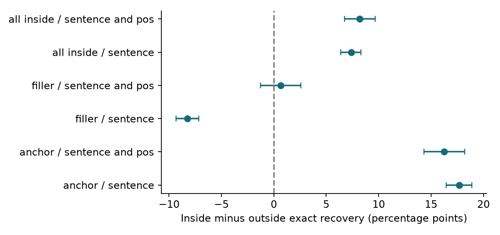
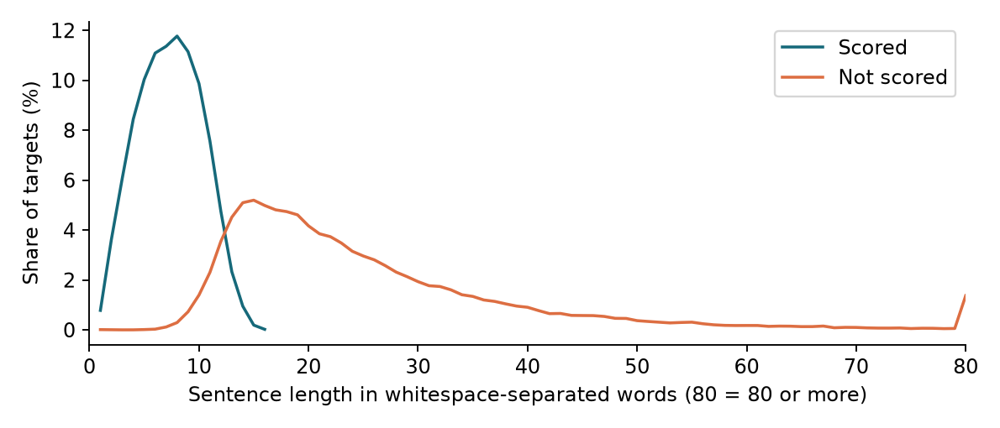

# Fixed words are easier to recover than variable words in Russian constructions

A full-inventory ruRoberta-large study with a partially scored corpus baseline. Preprint, 29 September 2026. Final analysis of the saved cutoff at 2026-09-28T20:47:25.005072+00:00. Not peer reviewed.

## 1. Abstract

We test whether a Russian masked language model predicts fixed construction words (anchors) more accurately than variable words (fillers). We examine all 4,001 Russian Constructicon entries; 3,843 are represented after preparation. The primary analysis contains 35,742 anchors and 48,655 fillers. Exact recovery is 76.2% for anchors and 50.7% for fillers. The mean within-construction difference is +24.2 percentage points (95% confidence interval [23.1, 25.3]). The difference remains positive after adjustment for measured word properties. However, fillers have no clear advantage over outside-span words matched by sentence and part of speech. A same-form corpus comparison also favors anchors, but only 30.8% of eligible corpus targets were scored, with short sentences processed first. The study supports a broad Russian lexical predictability pattern. It does not establish accurate prediction of complete argument combinations or universal construction knowledge.

## 2. Related literature

Rozner et al. [1] use pretrained language-model distributions to investigate constructions. Their global affinity concerns the probability of a word given its sentence context. Local affinity compares prediction distributions before and after masking additional context. Their English experiments include fixed lexical material, idioms, and schematic constructions. Their section 5.1 uses six English construction types with about 50 examples each and single-token targets. We adapt the global measurement to Russian and add lexical-role and corpus-control comparisons.

RoBERTa [2] is a bidirectional Transformer encoder trained to recover masked tokens. It uses context on both sides of a missing word. The Russian model family described by Zmitrovich et al. [3] provides the ruRoberta-large checkpoint used here. The Russian Constructicon [4] is a curated resource of constructions and examples; its entries are not a frequency-weighted corpus sample.

Salazar et al. [5] describe masked-model pseudo-log-likelihood scoring. Kauf and Ivanova [6] show why visible pieces of the same word can inflate scores, and propose within-word left-to-right masking. Our multi-token measure follows this masking principle: later pieces remain hidden while earlier gold pieces are restored. We score individual words, not whole-sentence pseudo-log-likelihood. Exact recovery and top-five recovery complement probability scores because high probability and correct first choice are different outcomes.

## 3. Methodology and key hypotheses

The purpose is to test whether constructional context is associated with lexical predictability. Anchors are fixed lexical material identified by the existing parser. Fillers are words aligned to variable slots; a filler word is not necessarily an entire semantic argument. H1: anchors are easier to recover than fillers. H2: an anchor advantage remains after adjustment for grammatical category and word properties. H3: the same anchor forms are easier to recover in construction examples than in corpus controls. H4: fillers are easier to recover than outside-span words of the same part of speech in the same sentence. These are working hypotheses, not preregistered tests; the earlier 300-construction results were already known.

We parse the inventory, remove duplicate sentences, align word roles with construction boundaries, prepare controls, mask each target separately, and analyze the saved predictions. Known outside-span targets are removed from the primary construction analysis. Unmatched boundaries are flagged and checked in a matched-only sensitivity analysis. No new predictions were generated for this final analysis.

For a one-token word, global affinity is P(original token | all other sentence tokens). For a word split into k tokens, chain affinity is the product, over positions j = 1 to k, of P(original token j | sentence context, original prefix, masked token j and masked later word tokens). Log-chain affinity is the sum of these log probabilities. Exact recovery requires the original token to rank first at every step. The target length is supplied. Lemma affinity sums eligible one-token vocabulary alternatives with the same lemma; it is available for anchors and RNC controls, not fillers. Local affinity was not computed.

Pooled accuracy weights word occurrences. The primary paired difference first averages within each construction and role, then gives constructions equal weight. RNC comparisons average each form in each context and give matched forms equal weight. Outside-span comparisons average matched sentence or sentence–POS cells within constructions, then weight constructions equally. We use 10,000 percentile bootstrap resamples of constructions or forms (seed 20260926), two-sided Wilcoxon and sign tests, and construction-clustered standard errors for regression. The adjusted linear probability model includes role, POS, log(1 + token count), log(1 + sentence token count), character count, and log(1 + sample form frequency). POS is controlled for both anchors and fillers; automatic pymorphy3 tags use context-free analyses.

Confidence intervals describe resampling uncertainty within this dataset, not uncertainty across independently trained models or correction for selection bias. POS-specific sign tests receive Holm adjustment across tested categories. Other intervals and tests are nominal exploratory comparisons; effect sizes and robustness matter more than isolated small p-values. A confidence interval containing zero is inconclusive, not proof of equivalence.

## 4. Data, model architecture, and experiment

| Stage or dataset | Count |
| --- | --- |
| Source entries examined / eligible | 4,001 / 3,844 |
| Represented constructions / unique sentences | 3,843 / 15,897 |
| Completed construction targets / alignment exclusions | 92,846 / 5 |
| Primary anchors / fillers | 35,742 / 48,655 |
| Completed outside-span controls | 23,755 |
| RNC queried forms / forms with retained contexts | 3,754 / 3,682 |
| RNC retained targets / scoring exclusions | 165,896 / 124 |
| RNC scored / eligible but unscored | 50,992 / 114,780 |
| Forms represented in scored RNC data | 3,608 |

The official Constructicon snapshot [9] supplies entries and slot annotations. The Hugging Face derivative [10] supplies construction boundaries. They overlap and are joined, not counted as independent evidence. One eligible entry loses its only example during sentence deduplication. The scope audit removes 8,449 scored words outside the annotated span, leaving 84,397 primary targets in 15,895 sentences. All eligible entries were selected before scoring. No synthetic sentences were used.

The unchanged ai-forever/ruRoberta-large checkpoint has 24 Transformer layers, hidden size 1,024, 16 attention heads, feed-forward size 4,096, and approximately 355 million parameters. Its pinned configuration has 50,265 vocabulary entries and 514 position embeddings. The scoring limit is 512 input tokens, including special tokens. It uses byte-level subword tokenization, evaluation mode, and float32 CPU computation. There was no fine-tuning. No Colab predictions were imported. Model revision: 5192d064ca6ac67c14c40e017ce41612e010f05f [7].

RNC collection [8] finished all requested forms. It kept up to 50 contexts per form from at most three result pages, excluding wrong forms, duplicates, overlaps with Constructicon examples, incomplete snippets, and detectable co-anchor combinations. Controls can still contain constructions. Up to two words outside each eligible annotated span provide a separate sentence-matched baseline. These controls preserve sentence context but do not match word identity.

At the user-requested stop, RNC scoring covered 50,992 of 165,772 eligible targets. The scorer sorted sentences by token length. Scored RNC contexts have median 13 model tokens (range 3–19). The median whitespace length is 7 words for scored contexts and 21 for unscored contexts. This is a nonrandom cutoff. The corpus comparison cannot represent the full collected baseline.

## 5. Key results

### 5.1. Anchors, fillers, and probability scores

Anchor accuracy is 76.2% (95% interval [75.4, 77.0]); filler accuracy is 50.7% ([50.1, 51.3]). The paired difference is +24.2 points ([23.1, 25.3]), across 3,823 constructions; 2,891 favor anchors and 176 tie. Wilcoxon p = 1.75e-281. The adjusted difference is +11.0 points ([10.0, 11.9]; p = 3.94e-114.

| Metric | Anchors | Fillers |
| --- | --- | --- |
| Mean chain probability | 0.696 | 0.406 |
| Median chain probability | 0.934 | 0.264 |
| Mean single-token probability | 0.750 | 0.482 |
| Single-token exact recovery (n) | 81.3% (31,962) | 58.9% (38,341) |
| Multi-token exact recovery (n) | 32.8% (3,780) | 20.3% (10,314) |
| Single-token top-five recovery | 94.3% | 81.9% |

The paired chain-probability difference is +0.277 (95% interval [0.267, 0.287]); the single-token difference is +0.279 [0.269, 0.290]. Mean log-chain scores are −1.130 for anchors and −2.573 for fillers. Mean anchor lemma affinity is 0.769 across 31,962 one-token targets. Multi-token recovery is substantially lower in both roles. Probability products also depend on token count, so single- and multi-token results are separated.

### 5.2. POS and construction variation

Part of speech is associated with anchor recovery after adjustment (joint Wald p = 6.78e-50). Prepositions and conjunctions are recovered more often than nouns and finite verbs. This pattern also occurs among fillers: pooled preposition recovery is 94.1% for anchors and 95.1% for fillers, compared with 65.4% and 39.1% for nouns. Thus, grammatical composition explains part of the pooled role gap.

Automatically classified content-anchor constructions have very similar pooled anchor and filler accuracy (49.6% and 49.7%). Function-anchor constructions show 77.6% versus 52.7%, and mixed-anchor constructions show 79.8% versus 50.4%. These are descriptive groups, not validated semantic construction types. Boundary sensitivity changes the paired gap little: +24.0 points under the original rule and +24.2 points with matched boundaries only.

### 5.3. Comparisons with ordinary words

| Inside role vs outside | Difference, points (95% CI) | Constructions / Wilcoxon p |
| --- | --- | --- |
| anchor | +16.3 [14.3, 18.2] | 2,761 / 8.26e-54 |
| filler | +0.6 [-1.3, 2.6] | 2,800 / 0.471 |
| all inside | +8.2 [6.8, 9.7] | 3,384 / 1.15e-29 |

The strongest practical distinction is between anchors and fillers. Anchors show a clear sentence–POS matched advantage. Fillers show only +0.6 points, with an interval spanning −1.3 to +2.6 points. Their chain-probability difference is likewise inconclusive: +0.003 [−0.010, +0.016], Wilcoxon p = 0.368. Without POS matching, filler accuracy is lower by 8.2 points [−9.3, −7.1]. Matching changes the compared population as well as controlling category, so the difference between these estimates is not itself a causal POS effect.

The partial RNC comparison covers 3,608 forms. Equally weighted accuracy is 52.9% in construction contexts and 28.2% in scored RNC controls: +24.7 points ([23.5, 26.0]), Wilcoxon p = 4.24e-233. These rates differ from the pooled role rates because every matched form receives equal weight. The matched chain-, single-token-, and lemma-probability differences are +0.231 [0.221, 0.241], +0.257 [0.244, 0.270], and +0.268 [0.255, 0.281], respectively.

| RNC sensitivity comparison | Forms | Accuracy difference, points (95% CI) |
| --- | --- | --- |
| fully scored forms | 16 | +28.1 [7.6, 50.0] |
| same form and length bin | 3340 | +21.5 [20.1, 22.9] |
| same form and exact token length | 2518 | +19.4 [17.6, 21.3] |
| exclude under five tokens | 3608 | +24.7 [23.4, 26.0] |

Requiring at least five occurrences in each context gives +25.4 points [23.6, 27.2] across 1,230 forms. Restricting to forms for which the co-anchor filter applies gives +28.0 [26.6, 29.4] across 2,946 forms. Only 16 forms have all eligible contexts scored; their sign test is inconclusive (p = 0.070), despite the positive bootstrap interval. Length matching is an exploratory check on observed overlap. It cannot recover missing long-context outcomes or remove differences in genre, sense, position, or annotation quality.

### 5.4. Changes from the earlier Russian sample

Relative to the archived 300-construction experiment, pooled anchor accuracy rises from 74.2% to 76.2%, and filler accuracy from 49.9% to 50.7%. The paired role gap changes from +20.1 [16.0, 24.2] to +24.2 [23.1, 25.3] points. The adjusted gap changes from +9.7 [6.3, 13.1] to +11.0 [10.0, 11.9]. The main role conclusion is stable and more precise.

The sentence–POS matched all-inside comparison now has a clearly positive interval: +8.2 [6.8, 9.7] points, compared with +2.7 [−2.8, 8.2] previously. The filler-specific comparison remains inconclusive, changing from −2.7 [−9.9, 4.4] to +0.6 [−1.3, 2.6]. The RNC gap changes from +11.5 [1.1, 21.5] across 27 forms to +24.7 [23.5, 26.0] across 3,608 forms, but the new corpus sample is incomplete and length-biased. These are descriptive changes in estimates, not tests that the estimates differ: the construction samples overlap, sentence–POS aggregation was refined to weight sentences equally within constructions, and the corpus controls have different selection rules. No result establishes that the unchanged model itself improved.

## 6. Main conclusions, comparison, and limitations

The Russian results support a broad association between fixed lexical material and higher contextual predictability. H1 and H2 are supported within the analyzed data. H3 is supported only for the scored RNC subset. H4 is not supported: after sentence–POS matching, fillers have no clear accuracy or probability advantage over outside-span words. The positive all-inside average must therefore not be presented as evidence that variable arguments are generally easier to predict.

Relative to Rozner et al. [1], this is a partial methodological replication and Russian extension. It preserves global masked-word probability, but changes the language, checkpoint, inventory, and controls, and includes multi-token words. It does not reproduce local-affinity interventions, the full set of English contrasts, or the schematic-slot analyses. Agreement on lexical predictability therefore does not establish generalization of every original result across languages or construction types.

Practical use is currently limited to scoring or ranking candidate words in supplied contexts. The pipeline recovers about half of filler word occurrences exactly; top-five recovery is higher for single-token fillers, but does not validate every alternative. Whole slots, multiple arguments, semantic appropriateness, and free generation were not evaluated. The visible gold sentence and known target length make the task easier than predicting an entire argument combination. High-accuracy argument generation is an open research goal.

The main limitations are nonrandom RNC stopping; automatic role and context-free POS labels; curated examples and unequal numbers of examples per construction; imperfect negative controls; one model and language; and unknown training-data overlap. Sample frequency is not training frequency. Bootstrap clusters do not fully model shared documents or vocabulary across constructions. No local-affinity ablation, calibration study, human acceptability evaluation, or independent full annotation audit was performed. Very small p-values do not remove these limits.

Future work should score a balanced or complete corpus baseline, match genre and word sense, manually validate a stratified sample, and use context-aware morphology. Local-affinity interventions could test which context words affect predictions. A practical argument-prediction system would need whole-slot and multi-slot candidate generation, morphology and agreement constraints, held-out constructions and documents, and human judgments of acceptable alternatives. Comparisons across languages and checkpoints are needed before broader generalization.

## 7. References

[1] Rozner, J., Weissweiler, L., Mahowald, K., and Shain, C. (2025). Constructions are Revealed in Word Distributions. EMNLP, 2116–2138. [Source](https://aclanthology.org/2025.emnlp-main.108/).

[2] Liu, Y., Ott, M., Goyal, N., Du, J., Joshi, M., Chen, D., Levy, O., Lewis, M., Zettlemoyer, L., and Stoyanov, V. (2019). RoBERTa: A Robustly Optimized BERT Pretraining Approach. arXiv:1907.11692. [Source](https://arxiv.org/abs/1907.11692).

[3] Zmitrovich, D., et al. (2023). A Family of Pretrained Transformer Language Models for Russian. arXiv:2309.10931. [Source](https://arxiv.org/abs/2309.10931).

[4] Janda, L. A., Lyashevskaya, O., Nesset, T., Rakhilina, E., and Tyers, F. M. (2018). A Constructicon for Russian: Filling in the Gaps. In Constructicography: Constructicon Development Across Languages, 165–181. John Benjamins. [Source](https://doi.org/10.1075/cal.22.06jan).

[5] Salazar, J., Liang, D., Nguyen, T. Q., and Kirchhoff, K. (2020). Masked Language Model Scoring. ACL, 2699–2712. [Source](https://aclanthology.org/2020.acl-main.240/).

[6] Kauf, C., and Ivanova, A. A. (2023). A Better Way to Do Masked Language Model Scoring. ACL Short Papers, 925–935. [Source](https://aclanthology.org/2023.acl-short.80/).

[7] AI Forever. ruRoberta-large model card and pinned model files. Accessed September 2026. [Source](https://huggingface.co/ai-forever/ruRoberta-large/tree/5192d064ca6ac67c14c40e017ce41612e010f05f).

[8] Russian National Corpus. Main corpus and public API documentation. Collection completed 28 September 2026. [Source](https://ruscorpora.github.io/public-api/).

[9] Russian Constructicon. Official data repository; revision 7806b7d74c56192b97150b06f755be4d37ad5b3c. [Source](https://github.com/constructicon/russian-data/tree/7806b7d74c56192b97150b06f755be4d37ad5b3c).

[10] Futyn-Maker. Russian Constructicon dataset with span annotations; revision 92d19006cb041c81b4bc21a34ebf3e4e082c5b4d. [Source](https://huggingface.co/datasets/Futyn-Maker/russian-constructicon/tree/92d19006cb041c81b4bc21a34ebf3e4e082c5b4d).

## 8. Supplement

### 8.1. AI declaration

OpenAI Codex assisted with research-design discussions, hypothesis wording, literature discovery, code writing and debugging, run orchestration, statistical-analysis scripts, figures, and drafting and editing this English preprint. The user defined the research scope, provided RNC access, and requested the scoring stop. AI assistance was not an independent human annotation audit. Reported statistics were calculated by scripts from saved model outputs; the corpus sentences were obtained from the cited resources, not generated by AI. ruRoberta-large produced the predictions being evaluated and is distinct from the assistant used to prepare this report. Human authorship, attribution, and final scientific review must be settled by the researchers before external submission; this draft does not claim that such review has already occurred.

### 8.2. Reproducibility and supplementary results

The repository stores compact word-level numeric tables, bootstrap summaries, adjusted-model coefficients, POS comparisons, coverage audits, source revisions, and this report. Full corpus sentences, model weights, and credentials are excluded from Git. results/cutoff_snapshot.json fixes input and output hashes; results/cutoff_analysis.json records missing-target and length diagnostics. The strict default rejects incomplete scoring; the final analysis requires an explicit cutoff flag and matching hashes. Collection and scoring remain stopped. Source attribution is provided in [7–10].

Supplementary files: results/summary.json (primary effects and probability summaries); results/outside_summary.json (all sentence and sentence–POS comparisons); results/tables/within_pos_construction_differences.csv (Holm-adjusted sign tests); results/tables/rnc_cutoff_form_coverage.csv (per-form scoring coverage); results/tables/cutoff_*.csv (length and complete-form sensitivities). Numerically underflowed test probabilities are stored as zero by the statistical library and must be interpreted as below numerical resolution, never as literally zero probability.
